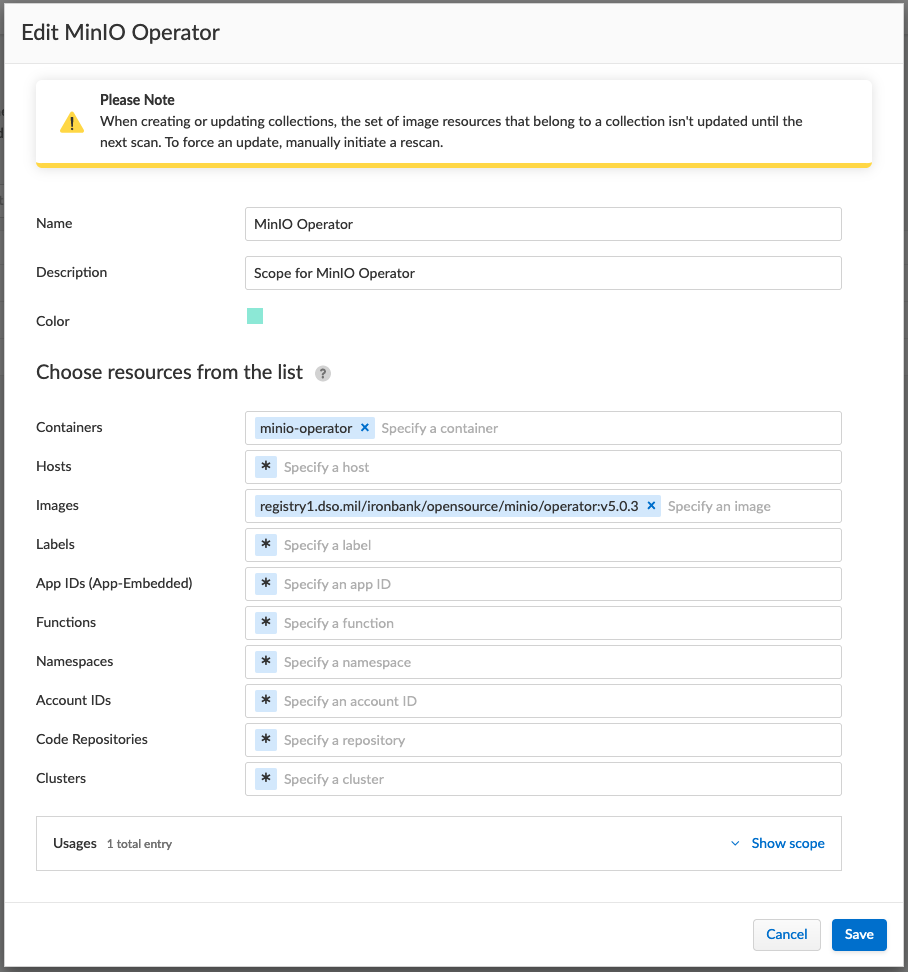
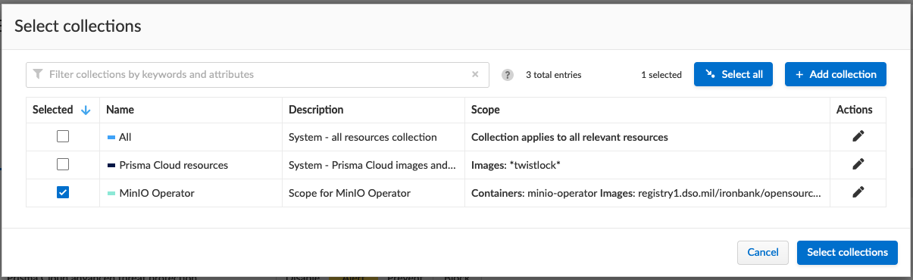
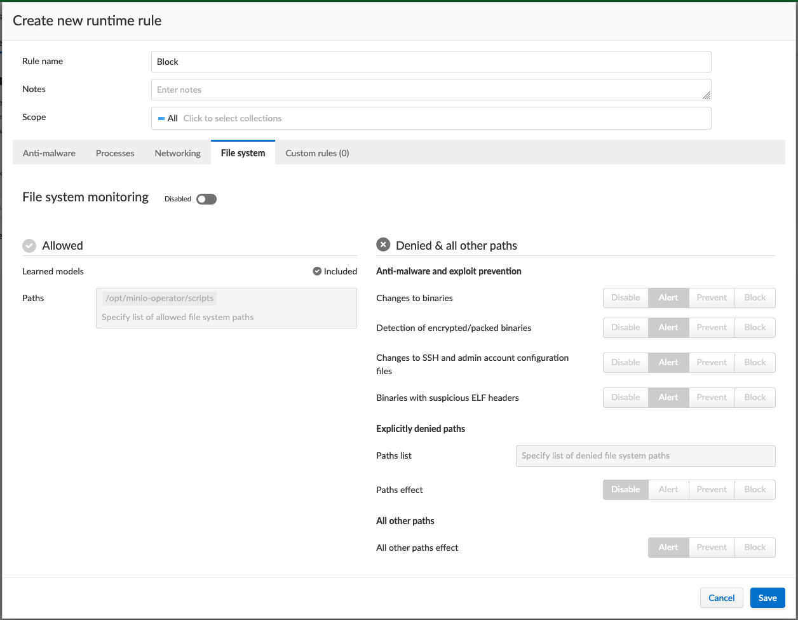
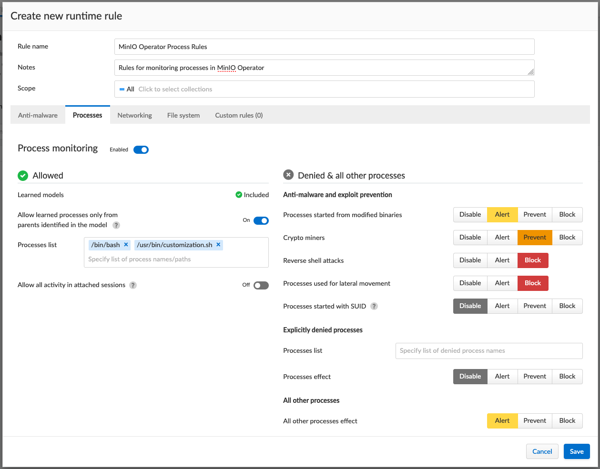

## What are Container Models? 

Models are automatically created and maintained by Twistlock when a new image is encountered in an environment. A model is effectively an "allow list" for what a given image should be doing. For example, a model for an Apache image would detail the specific processes that should run within containers derived from the image and what network sockets should be exposed. 

You can find existing Container Models by navigating to the Twistlock console, and selecting 'Container Models' in the 'Runtime' tab, under the 'Monitor' heading in the menu on the left.

You can create custom rules which run alongside Container Models by defining Container Runtime Policies. These policies act as additional rules which take action, such as blocking or alerting, when certain behaviors are detected.

## Useful Links

You can find more exhaustive documentation here:

* https://docs.paloaltonetworks.com/prisma/prisma-cloud/prisma-cloud-admin-compute/runtime_defense/runtime_defense_containers 

## Create a Scope

When creating a new rule, you probably also want to define the scope of the rule. You can define the scope by container, host, image, lables, namespaces, etc.

1. Navigate to the Twistlock console.
1. Select 'Collections and Tags' under 'Manage' from the menu on the left.
1. Select 'Add a collection' above the table on the 'Collections' page.
1. Fill out the resulting form, defining containers, hosts, etc. to configure your new scope.

## Create a Rule

We will use the scope defined above to create a new rule. Rules define what actions should be taken if Twistlock encounters a given behavior.

1. Navigate to the Twistlock console.
1. Select 'Runtime' under 'Defend' from the menu on the left.
1. Select ' + Add rule' above the table on the 'Container runtime policy' page.
1. Select the scope you created previously.

1. Fill out the resulting form. Take care to select each configuration option you need using the tabs, just below the 'Scope' field.

  * This step may take some time to get right. Incorrectly configuring a rule may result in errors.

