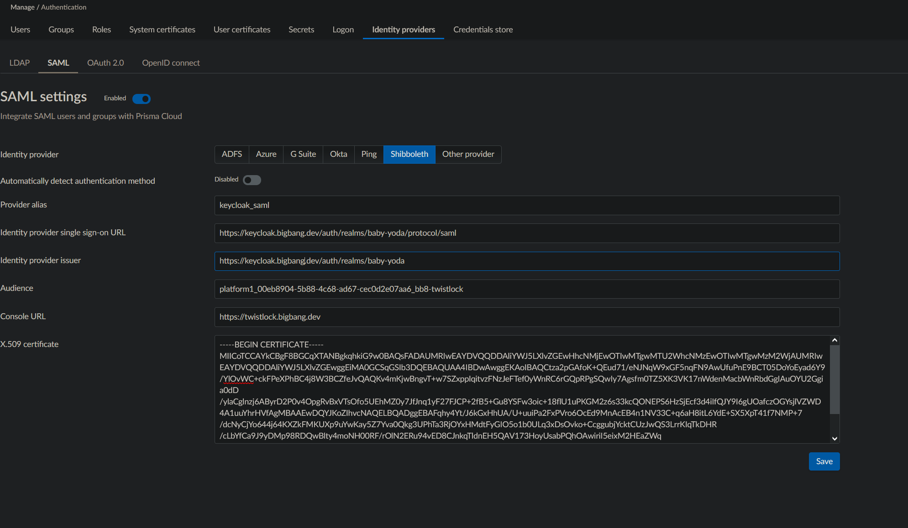
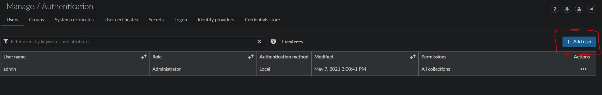
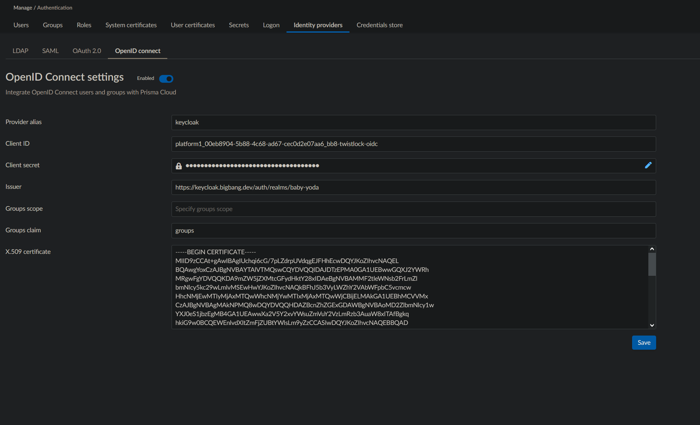
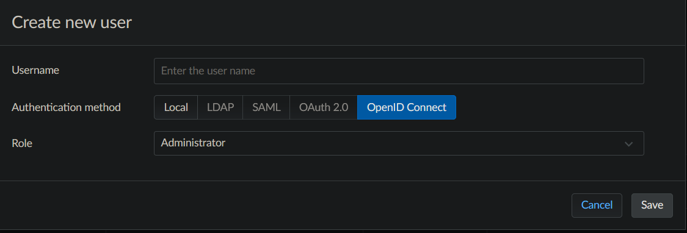

# Keycloak integration

- [IdP Integration with SAML](#integrating-with-saml)
- [SAML Configuration Items](#twistlock-manual-saml-configuration)
- [IdP Integration with OIDC](#integrating-with-oidc)
- [OIDC Configuration Items](#twistlock-manual-oidc-configuration)

## Integrating with SAML

Integrating Prisma Cloud with SAML consists of setting up your IdP, then configuring Prisma Cloud to integrate with it. For keycloak integration we will use use Shibboleth as the IdP type. Here is the official [SAML documentation](https://docs.prismacloud.io/en/compute-edition/34/admin-guide/authentication/saml) if needed.

Setting up Prisma Cloud in Keycloak

1. These instructions assume that Keycloak is properly installed and configured with a realm other than master.

2. In Keycloak select the realm

3. On the left column, select "Clients", then click button `Create`.

4. The client can be manually created. Or the example [twistlock-saml-client.json](twistlock-saml-client.json) can be imported after clicking the `Create` button. Make any necessary changes and click `Save` button.  Example settings:

   Client ID:  platform1_00eb8904-5b88-4c68-ad67-cec0d2e07aa6_bb8_twistlock
   Client Protocol: saml

   Settings TAB (accept defaults except for the following)
   Name: twistlock
   Sign Assertions: ON
   Client Signature Required: OFF
   Root URL:  https://twistlock.dev.bigbang.mil/api/v1/authenticate
   Valid Redirect URIs: *

5. Select the "Installation" tab. In the `Format Option dropdown` select `Mod Auth Mellon files`. Then click the `Download` button. Information from this file is needed to configure Twistlock.

6. Create a test user in Keycloak for testing the Twistlock SSO authentication and ensure they are part of the group matching the hash in the client_id eg: `00eb8904-5b88-4c68-ad67-cec0d2e07aa6`

## Twistlock SAML configuration

With the init script, Twistlock SAML SSO integration along with creating additional users can be automated via `sso.enabled: true` and `console.additionalUsers`. Refer to [here](./initialization.md#sso) for more information.

Alternatively you can manually configure Twistlock SSO integration through the Administration UI. When Twistlock is deployed for the first time the login will ask you to create an admin user. Login with the admin user and follow these instructions:

1. Navigate to the Twistlock console URL. After installation you will be asked to create an admin user and enter license key.

2. (Optional) Navigate to ```Manage -> Authentication``` in the left navigation bar. Select ```System Certificates``` (it might be in a drop down list if your browser is narrow). Enter the concatenated certificate and private key that matches your console domain. This is necessary so that the twistlock server can do TLS to Keycloak. When you click the ```Save``` button you will be logged out. You will have to log in again with the admin credentials.

3. Navigate to `Manage -> Authentication` in the left navigation bar. Click on `Identity providers` Tab & select `SAML` (it might be in a drop down list if your browser is narrow). Then turn on the enabled switch. Use identity provider "Shibboleth". This provider selection was recommended by Twistlock support.

4. Fill in the form. Example values are shown below. Use the values for your specific IdP. You can get the values from the installation files ```idp-metadata.xml``` and ```sp-metadata.xml``` in the zip archive downloaded from Keycloak from step #6 in the previous section.
     a. Identity provider single sign-on URL: this is the Keycloak SAML authentication endpoint. The value can be found inside the ```<SingleSignOnService>``` tag in the ```idp-metadata.xml``` installation file.
        ```https://keycloak.dev.bigbang.mil/auth/realms/baby-yoda/protocol/saml```
     b. Identity provider issuer: enter the Keycloak URL path to the realm. The value can be found inside the ```<EntityDescriptor>``` tag in the ```idp-metadata.xml``` installation file.
        ```https://keycloak.dev.bigbang.mil/auth/realms/baby-yoda```
     c. Audience:  this is the Keycloak Client ID. The value can be found inside the ```<EntityDescriptor>``` tag as ```entityID``` in the ```sp-metadata.xml``` installation file.
        ```il2_00eb8904-5b88-4c68-ad67-cec0d2e07aa6_twistlock```
     d. Console URL: This is the console URL of the Twistlock app. It is optional
        ```https://twistlock.dev.bigbang.mil```
     e. x509 certificate: This is the certificate from Keycloak. The value can be found inside the ```<dsig:X509Certificate>``` tag in the ```idp-metadata.xml``` installation file.  The field must contain 3 lines with the begin and end certificate as show below. Do not leave any blank spaces at the beginning or ending of the 3 lines. If this is not followed exactly the SAML authentication will fail.
     ```
     -----BEGIN CERTIFICATE-----
     (certificate from the install file)
     -----END CERTIFICATE-----
     ```
     f. When all fields in the web form are completed select "Save".

   *note: after SAML is added, the twistlock console will default to the keycloak login page. If you need to bypass the saml auth process add ```#!/login``` the the end of the root url.*



5. Twistlock SSO does not create the users automatically. You must manually create the users before they can log in. Navigate to ```Manage -> Authentication``` in the left navigation bar. Select "Users" in the drop down list. Click the ```Add User``` button to create a twistlock user with the same name as the Keycloak user name. There should be a ```SAML``` auth method button to select. If this selection is not visible, go to a different tab, then return to users.




## Integrating with OIDC

Within recent versions of 21.04 Twistlock added support for OIDC Authentication.

Integrating Prisma Cloud with OIDC consists of setting up a client within your IdP, then configuring Prisma Cloud to integrate with it. Here is the official [OIDC documentation](https://docs.prismacloud.io/en/compute-edition/34/admin-guide/authentication/oidc) if needed.

Setting up Prisma Cloud in Keycloak

1. These instructions assume that Keycloak is properly installed and configured with a realm other than master.

2. In Keycloak select the realm

3. On the left column, select "Clients", then click button `Create`.

4. The client can be manually created. Or the example [twistlock-oidc-client.json](twistlock-oidc-client.json) can be imported after clicking the `Create` button. Make any necessary changes and click `Save` button.  Example settings:

   Client ID:  platform1_00eb8904-5b88-4c68-ad67-cec0d2e07aa6_bb8_twistlock-oidc
   Client Protocol: openid-connect

   Settings TAB (accept defaults except for the following)
   Name: twistlock   (Optional)
   Access Type `confidential`
   Standard Flow Enabled: ON
   Direct Access Grants Enabled: OFF
   Valid Redirect URIs: https://twistlock.dev.bigbang.mil/api/v1/authenticate/callback/oidc

5. Click on `Client Scopes` tab and ensure `profile` is the only "Assigned Default Client Scope" value.

6. Create a test user in Keycloak for testing the Twistlock SSO authentication, and ensure they are part of the group matching the hash in the client_id eg: `00eb8904-5b88-4c68-ad67-cec0d2e07aa6`.

## Twistlock manual OIDC configuration

Within recent versions of 21.04 Twistlock added support for OIDC Authentication.

1. Navigate to the Twistlock console URL. After installation you will be asked to create an admin user and enter license key.

2. (Optional) Navigate to ```Manage -> Authentication``` in the left navigation bar. Select ```System Certificates``` (it might be in a drop down list if your browser is narrow). Enter the concatenated certificate and private key that matches your console domain. This is necessary so that the twistlock server can do TLS to Keycloak. When you click the ```Save``` button you will be logged out. You will have to log in again with the admin credentials.

3. Navigate to `Manage -> Authentication` in the left navigation bar. Click on the `Identity providers` Tab & select `OpenID connect` (it might be in a drop down list if your browser is narrow). Then turn on the enable switch.

4. Fill in the settings form. Example values are shown below. Use the values for your specific IdP.



5. (Optional) Within the `X.509 certificate` field paste in your PEM Certificate Authority. This will be required the IdP is using a Certificate that is not trusted by the system trust store.

6. Twistlock SSO does not create the users automatically. You must manually create the users before they can log in. Navigate to `Manage -> Authentication` in the left navigation bar. Select "Users" in the drop down list. Click the `Add User` button to create a twistlock user with the same name as the Keycloak user name. There will be an `OpenID Connect` auth method button to select. If this selection is not visible, go to a different tab, then return to users.



