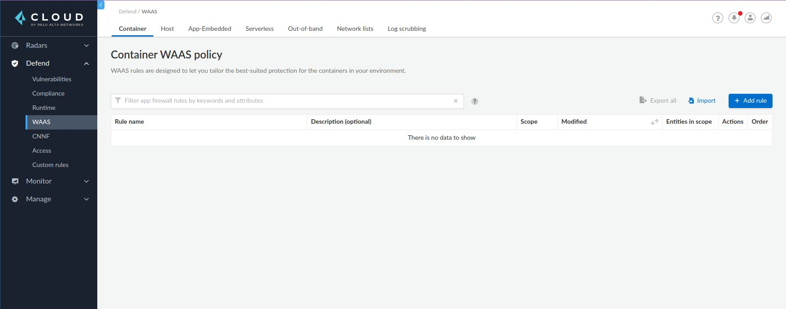
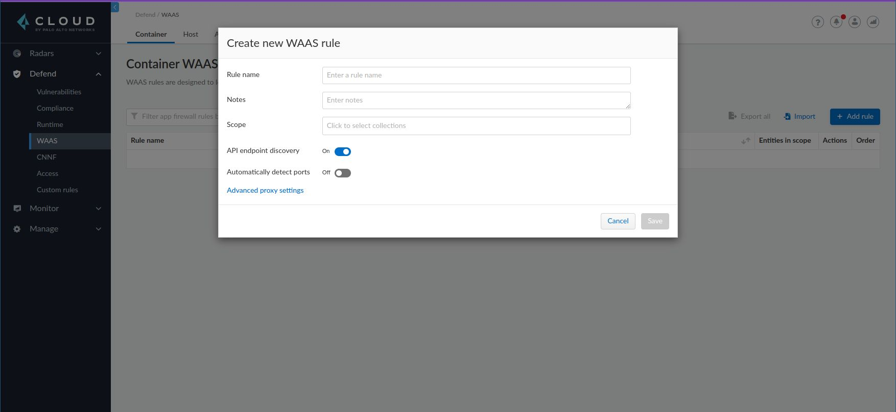
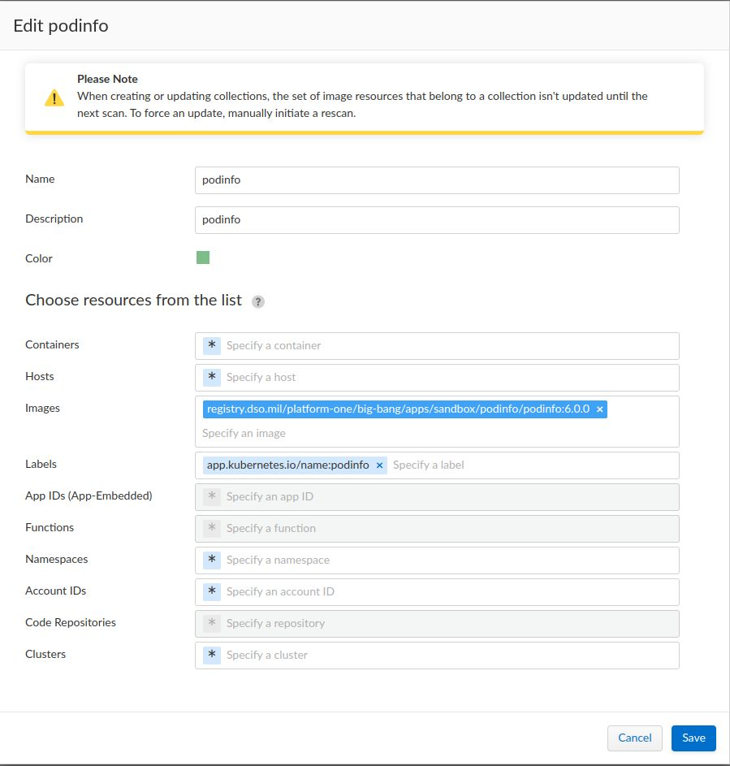
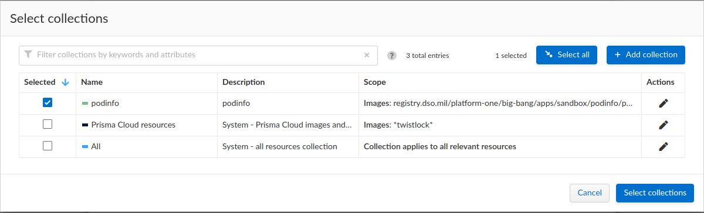
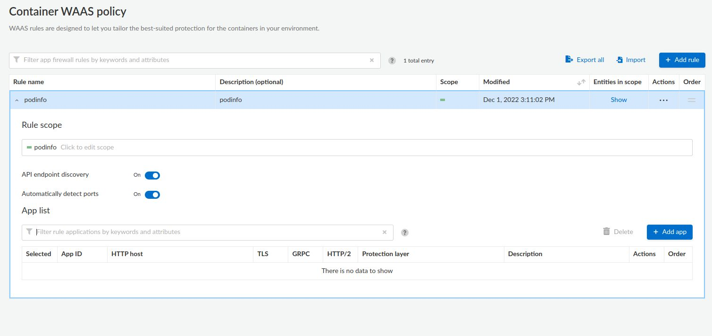
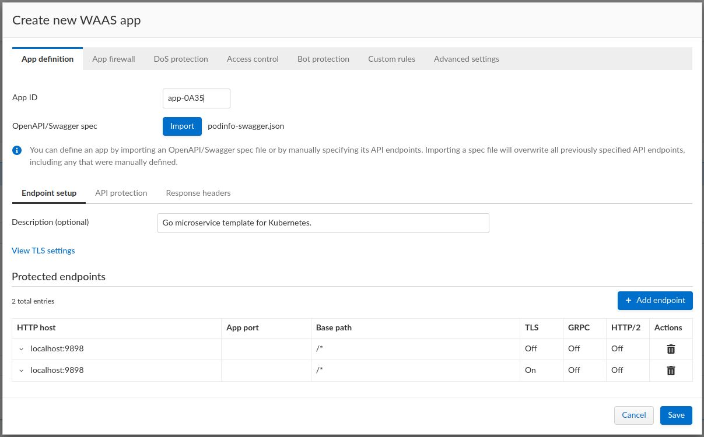
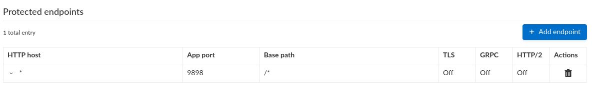
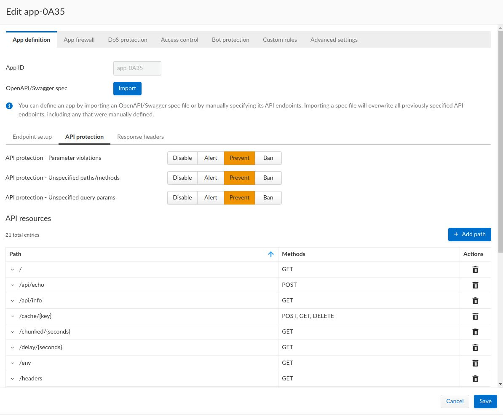

## What is a WAAS? 

WAAS (Web-Application and API Security, formerly known as CNAF, Cloud Native Application Firewall) is a web application firewall (WAF) designed for HTTP-based web applications deployed directly on hosts, as containers, application embedded or serverless functions. WAFs secure web applications by inspecting and filtering layer 7 traffic to and from the application.

## Useful Links
* https://docs.paloaltonetworks.com/prisma/prisma-cloud/prisma-cloud-admin-compute/waas
* https://www.youtube.com/watch?v=fsq5KlaBv2Q

## Deploy a WAAS in BigBang via the Twistlock Console

Configuring a WAAS in BigBang can be done via the Twistlock Console or via the [API](https://prisma.pan.dev/api/cloud/cwpp/policies#operation/put-policies-firewall-app-container). WAAS rules can also be imported/exported creating neccesary associated collections and applications.

## Values Configuration

In order to provide the correct permissions to enforce a WAAS the defenders must be running as privileged. To deploy this way set the below values:

```yaml
  values:
    console:
      license: "<license>"
    defender:
      selinux: false
      privileged: true
```

## Create Rule via Console UI

This guide will walk through creating a WAAS rule and testing it for an example application [podinfo](https://repo1.dso.mil/platform-one/big-bang/apps/sandbox/podinfo).

* Open `https://twistlock.bigbang.dev/#!/defend/waas/container`
* Navigate to Defend > WAAS > Container.

* Click **Add rule** and add a name for the new rule. 

* Select the **Scope** / **Click to select collections** field, a Scope is a particular [collection](https://docs.paloaltonetworks.com/prisma/prisma-cloud/prisma-cloud-admin-compute/configure/collections) which defines the targets for the rule. Select **Add collection** and fill out the fields to match images you want.

* Ensure your scope/collection is selected by the rule and click **Select Collections**

* Save your WAAS rule by clicking the **Save** button

### Add application

* Expand your new rule then click the **Add app** button to move to create an application, which allows you to define endpoints and API protections.

* The easiest way to configure an application is to import an OpenAPI definition. The OpenAPI definition for podinfo can be accessed here: https://podinfo.bigbang.dev/swagger.json.

* After importing the swagger document, you must also then make the following changes to the endpoints:
  - Delete the endpoint with `TLS: On` 
  - Expand the remaining endpoint, set the host to `*` and provide an App port (in this case `9898`), then save your changes

* To permit only endpoints defined in the OpenAPI definition, click **PREVENT** for all of the options under the **API protection** tab

* Click **Save**, it may take a few moments to fully save the rule

### Verify WAAS is being enforced

```bash
# Request to endpoint included in OpenAPI works
$ curl -i https://podinfo.bigbang.dev/healthz
HTTP/1.1 200 OK
Content-Length: 20
Content-Type: application/json; charset=utf-8
Date: Mon, 05 Dec 2022 19:59:10 GMT
X-Content-Type-Options: nosniff
X-Frame-Options: SAMEORIGIN
X-Prisma-Event-Id: 460edea5-c037-42da-7596-abda35519823

{
  "status": "OK"
}
```
```bash
# Request to endpoint not included in OpenAPI returns 403 via Prisma Cloud
$ curl -i https://podinfo.bigbang.dev/foo
HTTP/1.1 403 Forbidden
X-Prisma-Event-Id: f452fd01-4e58-7350-396a-c59dc155ad48
Date: Mon, 05 Dec 2022 19:58:45 GMT
Content-Type: text/html; charset=utf-8
Transfer-Encoding: chunked

```

## Import a WAAS Rule
* As an alternative to creating a WAAS in the Twistlock Console, A WAAS rule can be imported from a previously exported `.json` file. An example WAAS rule for the podinfo application is included in [podinfo-firewall-waas.json](docs/podinfo-firewall-waas.json)

* Open `https://twistlock.bigbang.dev/#!/defend/waas/container`
* Navigate to Defend > WAAS > Container.

* Click **Import** and select `docs/podinfo-firewall-waas.json`

## Known Issues
* WAAS or any functionality that depends on `iptables-*` being available does not function when running in K3D, similar to issues referenced in [k3d.md](docs/k3d.md)